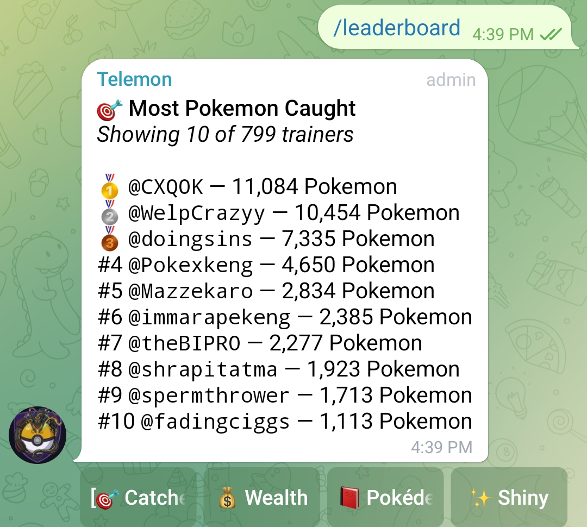

<div align="center">

# 🎯 Telemon Pokemon Auto-Catcher

### A blazing-fast, async Python bot for auto-catching Pokémon on Telegram's Telemon bot — runs 24×7 in DM + Group mode simultaneously.

[](https://python.org)
[](https://docs.telethon.dev)
[](LICENSE)
[](https://t.me/cxqok)

---

> 🏆 **Creator's Proof** — Bot creator `@CXQOK` holds **#1 on the global leaderboard** with **11,084 Pokémon caught**



---

</div>

## ✨ Features

| Feature | Details |
|---|---|
| 🤖 **Dual Mode** | Runs DM mode & Group mode simultaneously via async tasks |
| 🧠 **Smart Hint Parser** | Parses underscore patterns (`_ _ k _ c h u`) and direct Pokémon names from hint messages |
| ⚡ **Auto-Catch** | Sends `/catch <pokemon>` instantly when the Pokémon is identified |
| 🗂️ **Full Pokédex** | Contains all Pokémon from Gen 1 through Gen 9 (1025+ Pokémon) |
| 🔄 **Evasion Auto-Use** | Sends `/use 202` every 5 minutes automatically to keep Pokémon spawning |
| 🛡️ **Flood Guard** | Handles Telegram `FloodWaitError` gracefully — auto-retries after wait |
| 💾 **Session Saving** | Saves Telegram session after first login — no OTP needed on subsequent runs |
| 📋 **Logging** | Timestamped logs for every hint received, match found, and catch sent |
| 🔁 **Multi-Group** | Supports multiple groups — more groups = more catches (see note on rate limits) |

---

## 🗂️ Project Structure

```
Pokemon_catcher.py
├── HintParser              # Parses Telemon hint messages to identify Pokémon
│   ├── parse_hint()        # Extracts pattern or direct name from hint text
│   ├── matches_pattern()   # Matches underscore pattern against Pokédex entries
│   └── find_matches()      # Returns list of matching Pokémon names
│
├── DMPokemonCatcher        # Handles DM-based catching (with Telemon_robot)
│   ├── start()             # Connects client, resolves users, starts tasks
│   ├── _send_hints_periodically()         # Sends /hint every 6.3s
│   ├── _send_custom_message_periodically() # Sends /use 202 every 5 min
│   └── _process_message()  # Listens & processes DM messages
│
├── GroupPokemonCatcher     # Handles Group-based catching
│   ├── start()             # Connects client, resolves groups, starts tasks
│   ├── _send_hints_periodically()         # Sends /hint to groups every 6.3s
│   ├── _send_custom_message_periodically() # Sends /use 202 every 5 min
│   └── _process_message()  # Listens to group messages from hint bot
│
└── MultiModeController     # Orchestrates both DM & Group mode together
    ├── start_all()         # Starts both modes concurrently
    └── stop_all()          # Gracefully cancels all tasks and disconnects
```

---

## ⚙️ Setup & Configuration

### Step 1 — Get Telegram API Credentials

1. Go to [https://my.telegram.org/auth](https://my.telegram.org/auth)
2. Log in and navigate to **API Development Tools**
3. Copy your `API_ID` and `API_HASH`

> 🆘 Need help? Message [@team7x_chat](https://t.me/team7x_chat)

---

### Step 2 — Configure the Script

Open `Pokemon_catcher.py` and fill in the following:

```python
API_ID       = 123456            # Your API ID (integer, no quotes)
API_HASH     = "your_api_hash"   # Your API Hash (string)
PHONE_NUMBER = "+91XXXXXXXXXX"   # Your phone number with country code
```

**Group Configuration:**

```python
GROUP_TARGET_GROUPS = [
    "group_username_1",   # Recommended: add exactly 2 groups
    "group_username_2"    # More groups = faster catches but faster rate limits
]
```

> ⚠️ **Recommended:** Use **2 groups** for stable 24×7 operation. The bot also uses 1 DM (Telemon_robot) by default, so it runs across 3 channels total.

---

### Step 3 — Buy Evasion Item

Before running, make sure you have the evasion item active:

```
/buy 202        ← Run this in Telemon_robot chat to buy evasion
```

> 📌 Evasion keeps Pokémon spawning. Buy **50+** for non-stop sessions.

---

### Step 4 — Install Dependencies

```bash
pip install telethon
```

---

### Step 5 — Run the Bot

```bash
python Pokemon_catcher.py
```

**First run only:**
- Enter the OTP sent to your Telegram account
- Enter your 2FA password (if enabled)

After first login, a session file is saved — future runs start automatically with no login required.

---

## 🔧 Configurable Parameters

| Variable | Default | Description |
|---|---|---|
| `DM_HINT_INTERVAL` | `6.3s` | How often `/hint` is sent in DM |
| `GROUP_HINT_INTERVAL` | `6.3s` | How often `/hint` is sent in groups |
| `CUSTOM_MESSAGE_INTERVAL` | `300s (5 min)` | How often `/use 202` is sent |
| `CUSTOM_MESSAGE_ENABLED` | `True` | Toggle evasion item auto-use |
| `CUSTOM_MESSAGE` | `/use 202` | The evasion command to send |

---

## 🧠 How the Hint Parser Works

Telemon sends hints in two formats:

**Format 1 — Underscore Pattern:**
```
Hint: _ i _ a _ h u
```
The parser extracts the pattern, filters the full Pokédex by length and matching letters, and catches instantly if only **1 match** is found.

**Format 2 — Direct Name:**
```
Hint: Pikachu
```
The parser detects the name directly in the Pokédex set and sends the catch command immediately.

---

## 🚦 How Catching Works

```
Telemon sends hint → HintParser reads hint text
        ↓
Pattern match or direct name detected
        ↓
If 1 match found → /catch <pokemon_name> sent immediately
If multiple matches → waits for more hint letters
If 0 matches → logs warning, waits for next hint
```

---

## 📊 Bot Modes

### 🔵 DM Mode (`DMPokemonCatcher`)
- Operates in private chat with `Telemon_robot`
- Listens to both incoming and outgoing messages
- Sends `/hint` every 6.3 seconds

### 🟢 Group Mode (`GroupPokemonCatcher`)
- Operates inside Telegram groups where Telemon is active
- Listens only to messages from the hint bot
- Supports multiple groups simultaneously

Both modes run **concurrently** using Python `asyncio`.

---

## ⚠️ Important Notes

- Adding more than 2 groups will **trigger rate limits faster** and may break 24×7 operation
- The bot uses **2 separate Telegram sessions** (`pokemon_session_dm` & `pokemon_session_group`) to avoid conflicts
- Evasion item (`/use 202`) must be purchased in-game before running
- Do **not** share your `API_ID`, `API_HASH`, or session files with anyone

---

## 📈 Proof of Performance

The bot creator `@CXQOK` sits at **#1 on the global Telemon leaderboard** with over **11,000 Pokémon caught** — proof that this bot works at scale.

---

## 🙌 Credits

**Designed & developed by [@CXQOK](https://t.me/cxqok)**

Support / Questions → [@team7x_chat](https://t.me/team7x_chat)

---

<div align="center">

*Free tool. Use responsibly. Happy catching! 🎮*

</div>
